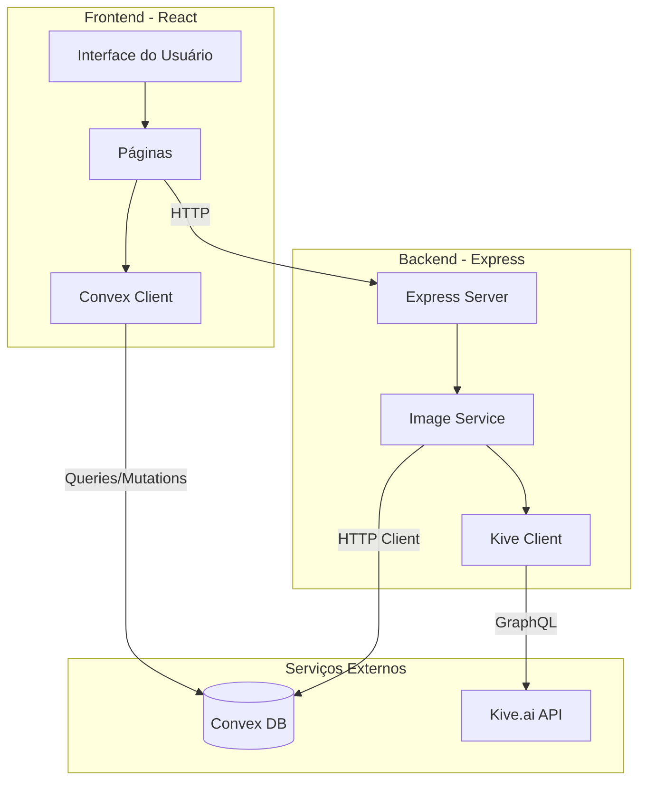

# Despachante App

<div align="center">


**Monorepo com aplicação web, backend e banco de dados**

[Instalação](#instalação) •
[Desenvolvimento](#desenvolvimento) •
[Deploy](#deploy) •
[Arquitetura](#arquitetura)

</div>

---

## Sobre o Projeto

Plataforma para geração e transformação de imagens de joias utilizando inteligência artificial. O sistema permite que joalheiros e designers visualizem suas peças em diferentes cores, cenários profissionais e em modelos.

### Funcionalidades

- **Transformação de Cores** - Altere cores de ouro e pedras preciosas
- **Foto Profissional** - Gere fotos de estúdio com iluminação profissional
- **Joia em Modelo** - Visualize joias em modelos profissionais
- **Try-On Virtual** - Experimente joias em fotos de usuários
- **Histórico** - Acompanhe todas as gerações com status em tempo real

---

## Estrutura do Projeto

```
despachante-app/
├── apps/
│   ├── web/                    # Frontend React (Vite + Tailwind + shadcn/ui)
│   │   ├── src/
│   │   │   ├── components/     # Componentes React
│   │   │   ├── pages/          # Páginas da aplicação
│   │   │   ├── contexts/       # React Contexts
│   │   │   ├── hooks/          # Custom hooks
│   │   │   ├── services/       # Serviços de API
│   │   │   └── lib/            # Utilitários
│   │   ├── Dockerfile
│   │   └── package.json
│   │
│   └── server/                 # Backend Express (Node.js)
│       ├── src/
│       │   ├── routes/         # Endpoints da API
│       │   ├── services/       # Lógica de negócio
│       │   └── config/         # Configurações
│       ├── Dockerfile
│       └── package.json
│
├── packages/
│   ├── convex/                 # Convex (banco de dados compartilhado)
│   │   └── convex/
│   │       ├── schema.ts       # Schema do banco
│   │       ├── auth.ts         # Autenticação
│   │       ├── users.ts        # Queries de usuários
│   │       └── upload_history.ts # Queries do histórico
│   │
│   └── shared/                 # Tipos e utils compartilhados
│       └── src/
│           └── types/          # Definições de tipos
│
├── .github/
│   └── workflows/
│       └── deploy.yml          # CI/CD GitHub Actions
│
├── turbo.json                  # Config Turborepo
├── pnpm-workspace.yaml         # Workspaces pnpm
├── tsconfig.base.json          # TypeScript base config
├── railway.json                # Config Railway
└── package.json                # Root package
```

---

## Pré-requisitos

- **Node.js** 20 ou superior
- **pnpm** 9 ou superior
- Conta [Convex](https://convex.dev)
- Conta [Kive.ai](https://kive.ai) (para geração de imagens)

---

## Instalação

### 1. Clone o repositório

```bash
git clone https://github.com/seu-usuario/despachante-app.git
cd despachante-app
```

### 2. Instale o pnpm (se necessário)

```bash
npm install -g pnpm
```

### 3. Instale as dependências

```bash
pnpm install
```

### 4. Configure as variáveis de ambiente

```bash
cp .env.example .env
```

Edite o arquivo `.env` com suas configurações.

---

## Configuração

### Variáveis de Ambiente

Crie um arquivo `.env` na raiz do projeto:

```env
# ===================================
# Frontend
# ===================================
VITE_APP_NAME=Despachante App
VITE_BASE_URL=/
VITE_API_BASE_URL=http://localhost:5000
CONVEX_URL=https://seu-projeto.convex.cloud

# Convex Auth
CONVEX_SITE_URL=http://localhost:5173
CONVEX_DEPLOYMENT=dev:seu-projeto

# ===================================
# Backend
# ===================================
PORT=5000

# Kive AI (geração de imagens)
KIVE_EMAIL=seu-email@exemplo.com
KIVE_PASSWORD=sua-senha

# Convex
CONVEX_URL=https://seu-projeto.convex.cloud
SERVER_API_KEY=sua-chave-api

# Arquivos
TEMP_FOLDER=./temp
UPLOAD_FOLDER=./assets/uploads
```

### Configuração do Convex

1. Crie uma conta em [convex.dev](https://convex.dev)
2. Instale a CLI: `npm install -g convex`
3. Faça login: `npx convex login`
4. Inicialize o projeto:

```bash
pnpm convex:dev
```

5. Configure a variável `SERVER_API_KEY` no dashboard do Convex

### Configuração do Convex Auth

O projeto usa `@convex-dev/auth` para autenticação. É necessário configurar as variáveis de ambiente `JWT_PRIVATE_KEY` e `JWKS` no dashboard do Convex.

#### Gerar Chaves JWT

1. Execute o script para gerar as chaves:

```bash
cd packages/convex
pnpm generate:jwt-keys
```

2. O script irá exibir duas variáveis de ambiente que você precisa copiar:
   - `JWT_PRIVATE_KEY` - Chave privada RS256
   - `JWKS` - JSON Web Key Set com a chave pública

#### Configurar no Dashboard do Convex

1. Acesse [https://dashboard.convex.dev](https://dashboard.convex.dev)
2. Selecione seu projeto
3. Vá em **Settings** > **Environment Variables**
4. Adicione as seguintes variáveis:
   - **JWT_PRIVATE_KEY**: Cole o valor da chave privada gerada
   - **JWKS**: Cole o valor do JSON Web Key Set gerado

#### Alternativa: Configuração Automática (Produção)

Para produção, você pode usar o comando automático:

```bash
npx @convex-dev/auth --prod
```

Este comando configura automaticamente as variáveis no dashboard do Convex.

**Nota:** Se você estiver usando apenas o provider Password (como no projeto atual), não é necessário configurar `SITE_URL`. Essa variável é necessária apenas para OAuth ou magic links.

---

## Desenvolvimento

### Iniciar todos os apps

```bash
pnpm dev
```

### Iniciar apps individualmente

```bash
# Frontend (http://localhost:5173)
pnpm dev:web

# Backend (http://localhost:5000)
pnpm dev:server

# Convex dev server
pnpm convex:dev
```

### URLs de desenvolvimento

| Serviço | URL |
|---------|-----|
| Frontend | http://localhost:5173 |
| Backend | http://localhost:5000 |
| Convex Dashboard | https://dashboard.convex.dev |

---

## Build

### Build de todos os apps

```bash
pnpm build
```

### Build individual

```bash
pnpm build:web
pnpm build:server
```

---

## Deploy

### Railway

O projeto está configurado para deploy no [Railway](https://railway.app) via GitHub Actions.

#### 1. Configure o Convex (antes do Railway)

```bash
# Deploy do Convex para produção
pnpm convex:deploy
```

#### 2. Configure o Railway

1. Crie um projeto no Railway
2. Adicione dois services:
   - **web**: Configure com `apps/web/Dockerfile`
   - **server**: Configure com `apps/server/Dockerfile`

#### 3. Variáveis de ambiente no Railway

**Service: web**

| Variável | Valor |
|----------|-------|
| `VITE_APP_NAME` | Nome da aplicação |
| `VITE_API_BASE_URL` | URL do service server |
| `CONVEX_URL` | URL do Convex (produção) |

**Service: server**

| Variável | Valor |
|----------|-------|
| `PORT` | `${{PORT}}` |
| `CONVEX_URL` | URL do Convex (produção) |
| `SERVER_API_KEY` | Chave configurada no Convex |
| `KIVE_EMAIL` | Email do Kive.ai |
| `KIVE_PASSWORD` | Senha do Kive.ai |

#### 4. Configure GitHub Actions

Adicione o secret `RAILWAY_TOKEN` no GitHub (Settings > Secrets).

---

## Scripts Disponíveis

| Comando | Descrição |
|---------|-----------|
| `pnpm dev` | Inicia todos os apps em desenvolvimento |
| `pnpm dev:web` | Inicia apenas o frontend |
| `pnpm dev:server` | Inicia apenas o backend |
| `pnpm build` | Build de produção de todos os apps |
| `pnpm build:web` | Build do frontend |
| `pnpm build:server` | Build do backend |
| `pnpm typecheck` | Verificação de tipos em todos os packages |
| `pnpm lint` | Linting em todos os packages |
| `pnpm clean` | Remove node_modules e dist |
| `pnpm convex:dev` | Inicia o Convex em desenvolvimento |
| `pnpm convex:deploy` | Deploy do Convex para produção |

---

## Arquitetura



### Fluxo de Geração de Imagem

1. **Upload**: Usuário faz upload da imagem via frontend
2. **Storage**: Imagem é salva no Convex Storage
3. **Histórico**: Entrada criada no histórico (status: processing)
4. **Requisição**: Frontend envia requisição para o backend
5. **Download**: Backend baixa imagem do Convex
6. **Processamento**: Backend envia para Kive.ai
7. **Geração**: Kive.ai processa e retorna imagem
8. **Upload**: Backend faz upload da imagem gerada para Convex
9. **Atualização**: Histórico atualizado (status: completed)
10. **Polling**: Frontend recebe status via polling

---

## Stack Tecnológica

### Frontend

| Tecnologia | Versão | Descrição |
|------------|--------|-----------|
| React | 19.0 | Biblioteca UI |
| TypeScript | 5.7 | Tipagem estática |
| Vite | 6.2 | Build tool |
| Tailwind CSS | 4.0 | Framework CSS |
| shadcn/ui | latest | Componentes UI |
| React Router | 7.3 | Roteamento |
| Convex | 1.31 | Cliente do banco de dados |

### Backend

| Tecnologia | Versão | Descrição |
|------------|--------|-----------|
| Node.js | 20+ | Runtime |
| Express | 4.18 | Framework web |
| TypeScript | 5.7 | Tipagem estática |
| Multer | 1.4.5 | Upload de arquivos |
| Convex | 1.31 | Cliente HTTP |

### Infraestrutura

| Tecnologia | Descrição |
|------------|-----------|
| Convex | Banco de dados + Storage |
| Railway | Hosting (Docker) |
| GitHub Actions | CI/CD |
| Turborepo | Build system |
| pnpm | Package manager |

---

## Packages

| Package | Descrição | Documentação |
|---------|-----------|--------------|
| `@despachante/web` | Frontend React | [README](apps/web/README.md) |
| `@despachante/server` | Backend Express | [README](apps/server/README.md) |
| `@despachante/convex` | Convex compartilhado | [README](packages/convex/README.md) |
| `@despachante/shared` | Tipos compartilhados | [README](packages/shared/README.md) |

---

## Contribuindo

1. Fork o projeto
2. Crie uma branch (`git checkout -b feature/nova-feature`)
3. Commit suas alterações (`git commit -m 'Adiciona nova feature'`)
4. Push para a branch (`git push origin feature/nova-feature`)
5. Abra um Pull Request

---

## Licença

Este projeto está licenciado sob a licença MIT.
